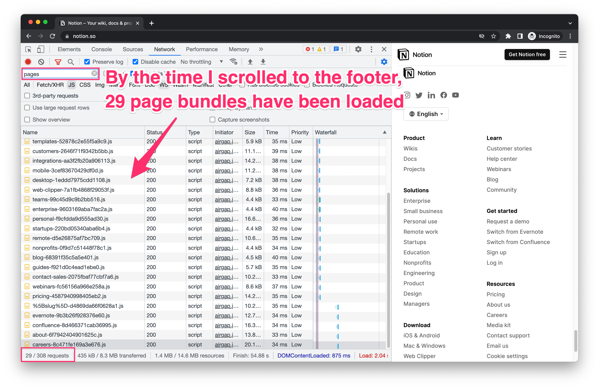

There is a famous quote from Donald Knuth that premature performance optimisation is the root of all evil. As usually happens with quotes, it was often taken out of context and amplified.

It’s 2023, and despite all the efforts, the web remains slow. Developers tend to blame frameworks, programming languages, browsers, and even customers who constantly change requirements. Every new library or tool states that it’s blazing fast, yet we keep building slow sites with it.

If we compare React bundle size throughout the years, it hasn’t significantly grown. What has grown is the amount of our own code written on top of React. It has grown so much that React itself started shifting its parts to the server (Server Components), which sounds insane for a frontend library!

In this article, we will see how the Next.js framework encourages performance-first development by offering or even enforcing several web optimisations out of the box. None of them are specific to Next.js. We can (and should) implement them using any other web development tools.

## Table Of Contents

[[TOC]]

## JavaScript Code Splitting

From the very beginning, Next.js provided a page-based routing system. To make your app available at example.com/about you had to create `pages/about.js` file in Next.js. Many developers found this structure intuitive and easy to use.

Under the hood, it allowed Next.js to implement [Route-based Splitting](https://www.patterns.dev/posts/route-based/), which was further optimised in [version 9.2](https://nextjs.org/blog/next-9-2#improved-code-splitting-strategy) to benefit from HTTP/2.

## Preload JavaScript on link visibility

Once we break our JS into multiple chunks, we must ensure they are loaded at the right time. Link component form Next.js prefetches corresponding page code using [Import on Visibility](https://www.patterns.dev/posts/import-on-visibility/) or [Import On Interaction](https://www.patterns.dev/posts/import-on-interaction/) patterns.

As you scroll down the notion.so website, you can notice some extra scripts are being loaded. If you then decide to go to another page, all necessary JavaScript will be already in place.



## Dynamic import 

Heavy code that is only used under certain circumstances can be lazy-loaded using Dynamic Import. This technique requires developers first to identify candidates for lazy loading and then implement a smooth loading experience for the user.

For many years, Next.js has been offering [`next/dynamic`](https://nextjs.org/docs/advanced-features/dynamic-import) function for this purpose. Under the hood, it’s just a wrapper around `React.lazy` and `Suspense` that you can use in any React project.

## Third-party scripts

As you may know, `<script>` tag behaviour is very complex. An external script can completely ruin your Web Vitals regardless of how well you optimise your code. Below is a quote from a brilliant tutorial by the Google team [“Optimise your loading sequence”](https://www.patterns.dev/posts/loading-sequence/):

> Scripts get different priorities based on where they are in the document and whether they are async, defer, or blocking. Blocking scripts requested before the first image ( or an image early in the document) are given higher priority over blocking scripts requested after the first image is fetched. Async/defer/injected scripts, regardless of where they are in the document, have the lowest priority. Thus we can prioritise different scripts by using the appropriate attributes for async and defer.

The main takeaway is that there is no one right way to include scripts on the site. We need to consider the entire loading sequence, versions of frameworks and browsers, the target audience of the site and a handful of other factors.

Back to Next.js, its [`<Script>`](https://nextjs.org/docs/basic-features/script) component provides a simplified interface for HTML `<script>` tag:

```jsx
<Script src="https://example.com/script.js" />
```

This code can be put anywhere in the app, and Next.js will load it at the most appropriate time (after the page becomes interactive). It’s best for most scripts, such as Google Tag Manager or Google Analytics.

If you need to load the script much earlier (or much later), you can use the `strategy` property.

## Fonts
The easiest way to optimise Largest Contentful Paint (LCP) metric is to place a large text block at the top of your page. For example, Next.js homepage uses `<h1>` as LCP element:


Commonly, web designs are based on non-standard fonts aka _web fonts_. Loading them from Google Fonts or similar services takes precious time and creates other issues like Cumulative Layout Shift (CLS).

Next.js team has been working on fonts optimisation since version 10. They started with inlining font CSS and adding `<link preconnect>` hint for the browsers and by [version 13](https://nextjs.org/blog/next-13#nextfont) ended up with built-in self-hosting and optimisation for any font file.

Font optimisation is hard, and I’m incredibly grateful to the Next.js team for handling it for me.

## Images
On many websites, the main contributor to performance issues is media. When I work on performance, I always start with images. They are usually easy to fix and bring an immediate, noticeable boost.

Thanks to WebP and AVIF, lazy loading and aspect-ratio, srcset and picture tag, we can deliver the most appropriate images to our users. Next.js offers a smart wrapper around `` tag that utilises all mentioned techniques (and probably more) to reduce the amount of development work required to render an image in 2023.

Below is a screenshot with the resulting markup generated by Next.js Image component from [this example](https://github.com/vercel/next.js/tree/canary/examples/image-component):


As with any opinionated solution, `next/image` has its limitations, but it’s a great starting point that sets the bar high.

## Static optimisation
A few years ago, the industry became obsessed with Static Site Generation (SSG). Good old static HTML was back under a fancy name. This very site was built using an early GatsbyJS version.

Indeed, static sites are more secure, faster, and cheaper. In 2020, [Next.js announced](https://nextjs.org/blog/next-9-3#next-gen-static-site-generation-ssg-support) Automatic Static Optimisation: a simple API that uses SSG for static parts of the app while serving the rest of the app dynamically.

Most dynamic sites couldn’t benefit from SSG at that time. First of all, it would require a massive rewrite. But the main problem was to trigger rebuilds every time you needed to update your static pages. We at SystemSeed overcame this issue by using Cloudflare CDN cache. You can learn more about this approach in my article [“Let Cloudflare CDN speed up your classic website like it’s static”](https://kalabro.tech/serve-like-static/). Guillermo Rauch, Vercel’s CEO, later contacted me about that article:


Messages like this are the greatest reward for the author! 💚

These days Next.js provides a built-in way to regenerate static pages. It’s called [Incremental Static Regeneration (ISR)](https://nextjs.org/docs/basic-features/data-fetching/incremental-static-regeneration).

## Edge Middleware

Next.js is funded by Vercel, a hosting platform that’s primary focus is speed. While most Next.js performance features are hosting-neutral, some are harder to self-host. [Edge Middleware](https://vercel.com/docs/concepts/functions/edge-middleware) is a good example. It’s inspired by (and based on) Cloudflare Workers. If you are a Vercel customer, you can immediately benefit from blazing-fast edge computing without leaving your favourite framework codebase. Amazing!

But even if we are not on Vercel, their setup inspires us to build something similar with the tools available to us.

> Vercel deploys the middleware code to edge functions, which are invoked before the request reaches the CDN. This allows static pages can be cached, as the middleware is called before the CDN sends back a cached response

The quote above is from the [OpenNext](https://github.com/serverless-stack/open-next) project, which aims to port Vercel setup to other serverless platforms.

## React Server Components and streaming SSR

From React 18 release notes:

> In React 18, you can start using Suspense for data fetching in opinionated frameworks like Relay, Next.js, Hydrogen, or Remix. Ad hoc data fetching with Suspense is technically possible, but still not recommended as a general strategy.

React is getting more complicated. It took several years to release Suspense, and it will take another few years to adopt it. Given the level of complexity, it’s wise to delegate implementation details to experienced frameworks’ maintainers.

Next.js 13, the latest release to date, introduces a new routing system that supports streaming SSR, Server Components, and Suspense for data fetching. By pushing more code to the server, we can reduce the client-side JavaScript and speed up hydration.

If you are new to React Server Components, I recommend to start with [Rendering Fundamentals](https://beta.nextjs.org/docs/rendering/fundamentals) documentation. Welcome to the new Next.js!

I’m sure the old pages routing will keep working for a while, but the new things will all go to the `app` directory.

## To summarise

I welcome you to rethink Knuth’s words about premature performance optimisation and embrace the “Fast by default” mindset when building websites. Not all optimisations are evil. Some of them have become common sense and should be applied _by default_.

Next.js is an excellent example of the “fast by default” mindset. It popularises web performance best practices by making them easy to use (or even enforcing on ESLint level). I like this approach and apply it to other tools.

Similar to mobile-first or security-first development cultures, it takes time to establish “fast by default” mindset, and I’m grateful to Next.js for helping me with it.