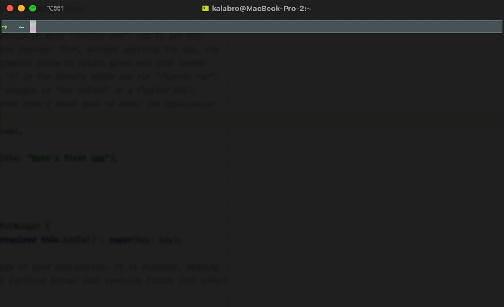
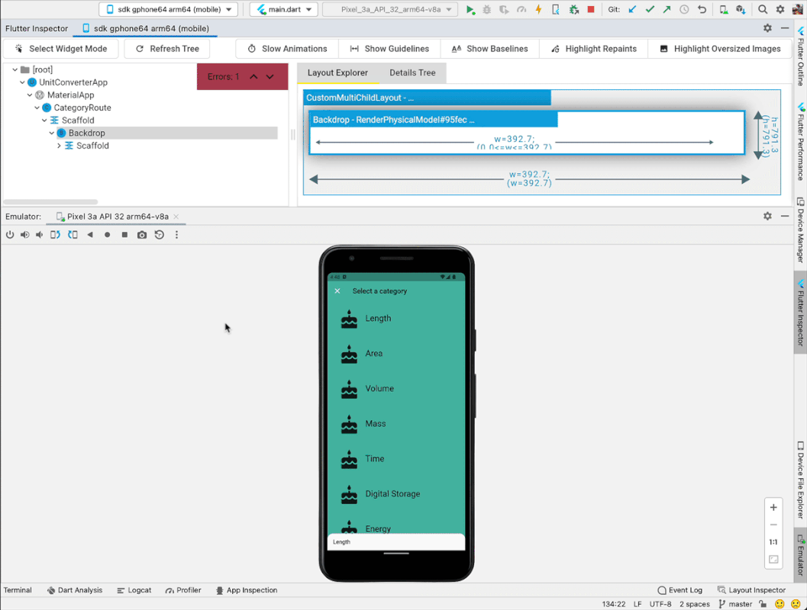
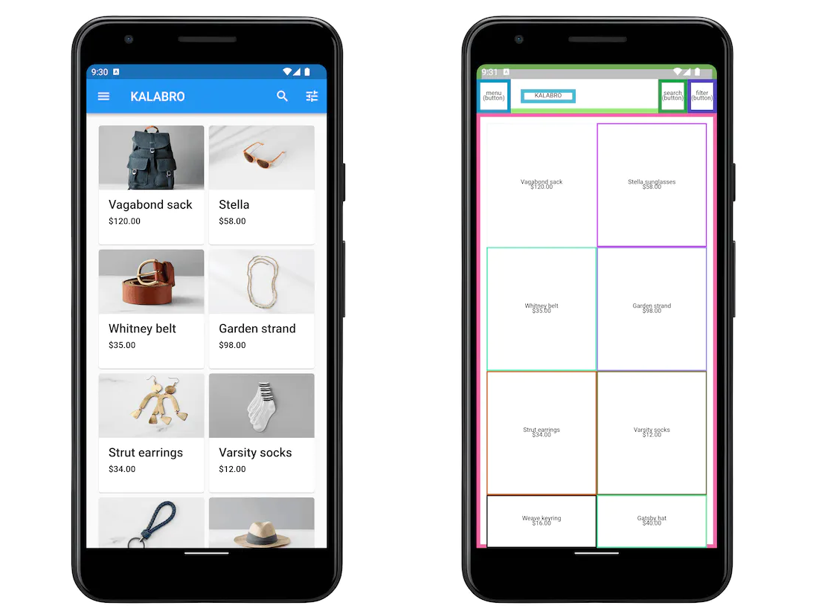
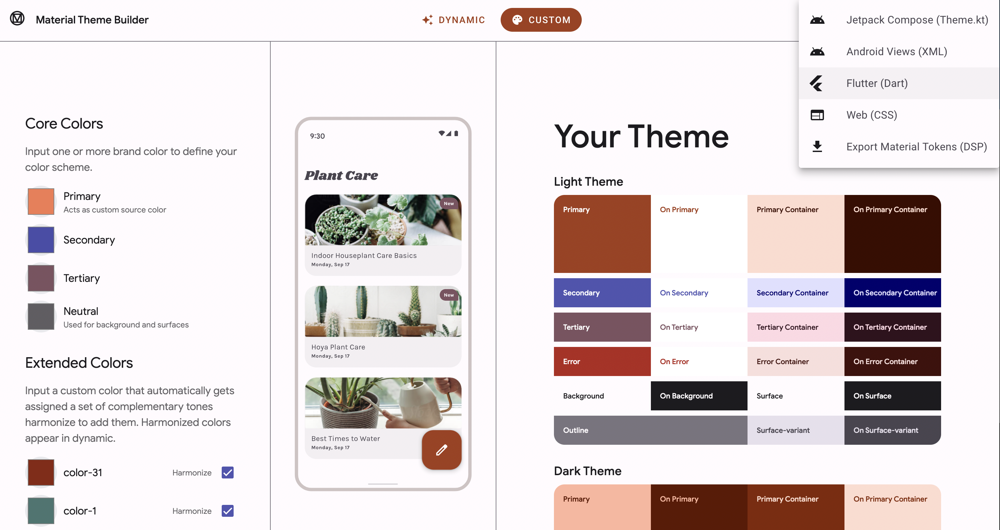
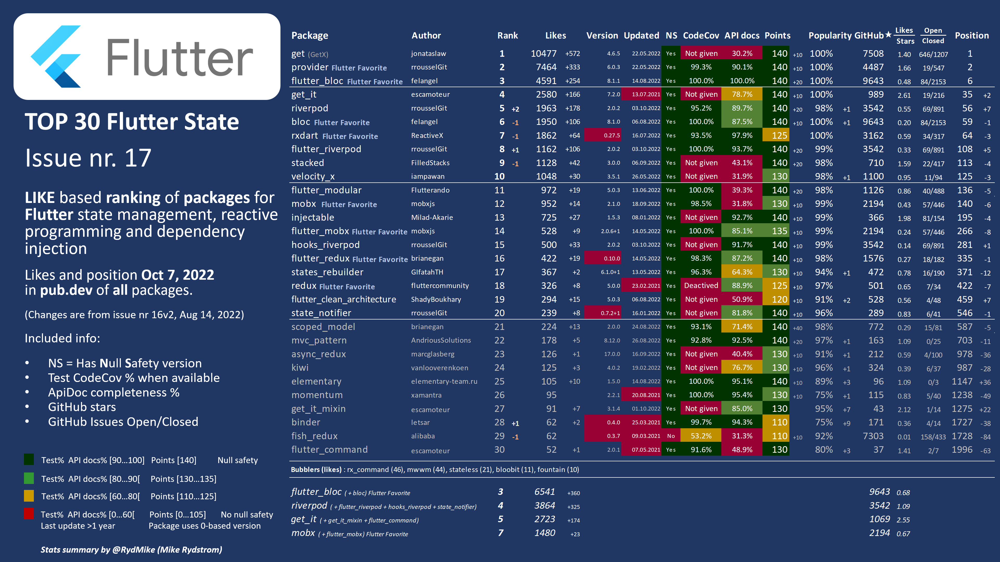

*Flutter is a popular framework for building cross-platform mobile apps. I had a chance to play with Flutter and found quite a few similarities with React. In this guide, I map common Flutter concepts to their equivalents in web development. If you are a React developer interested in Flutter, it will help you find your fit in the new territory.*

This article doesn’t question whether you should use Flutter, React Native, PWA or a native app approach. There are good use cases for each of them. Today we will focus on Flutter for mobile app development. Let’s dive in!

## Table Of Contents

[[TOC]]

## VS Code → VS Code

Most Flutter developers write code with the same tools as web developers.  
[VS Code with Flutter extension](https://docs.flutter.dev/development/tools/vs-code) is the most popular option. 

Android Studio has first-class Flutter support if you are more comfortable with IntelliJ IDEA. I picked this option and was quite happy with it. 

Like any other mobile dev setup, it takes time to prepare everything for cross-platform development. To help developers troubleshoot their local setup, Flutter comes with a handy utility `flutter doctor`: 



#### 💡 Get started with the local development environment:
- Carefully follow [official installation instructions](https://docs.flutter.dev/get-started/install). Don’t skip steps! 
- If you are not ready to install Flutter locally, you can also use [DartPad](https://dartpad.dev/), an online Dart & Flutter playground

I personally found the initial installation process more straightforward than for React Native.

## Chrome Dev Tools → Flutter Dev tools

It’s hard to imagine web development without the powerful dev tools we have in our browsers. 

Surprisingly, Flutter isn’t far behind. I started using Flutter widget inspector from day 1 to debug my widgets styling issues. Just like in Chrome, Flutter Inspector has multiple tabs, from Networking to Performance. It was interesting to explore my app from different angles there.



Last, you can debug Flutter code from your IDE using breakpoints. For some reason, I still prefer `console.log()` in JavaScript!

#### 💡 Get started with Flutter Dev tools:
- [DevTools](https://docs.flutter.dev/development/tools/devtools/overview) - official documentation 

## TypeScript → Dart

Flutter uses the Dart programming language. Dart is similar to JavaScript but with types and some nice syntax sugar on top of it. 
For example, Dart has an async functionality, but `Promises` are called `Futures` there. 

If we need an array in the JavaScript sense, in Dart, we use a List:

```dart
var nav = ['Home', 'Furniture', 'Plants', if (promoActive) 'Outlet'];
```

The example above is a List of Strings. The last item is only added if `promoActive` is true. Neat!

#### 💡 Get started with Dart:
- [Learning Dart as a JavaScript developer](https://dart.dev/guides/language/coming-from/js-to-dart) - half an hour, and you are ready to go!

My experience with Dart was only positive so far. You don’t need to spend time configuring TypeScript or Webpack. With Dart, everything is built-in and ready to use.

## ESlint → Dart lint

Dart & Flutter have built-in code analysing and formatting tools. It makes it easy to learn framework best practices. I was happy with the default linters setup, but it’s possible to customise it too.

#### 💡 Get started with linters:
- When you start a new Flutter project, the linters should be preconfigured for you
- For customisation check [Dart linter rules](https://dart.dev/tools/linter-rules) and [Flutter linter rules](https://pub.dev/packages/flutter_lints)

## div → Widget

**Everything in Flutter is a widget.**  
If you compare them to HTML tags, Flutter widgets are usually much more specialised.

For example, “to center a div” in Flutter, you use the specialised Center widget:

```dart
Center(
    child: const Text("I’m centered!")
),
```

It takes time to get familiar with all built-in Flutter widgets. I don’t think I explored even half of them. 

#### 💡 Get started with Widgets:
- Scan through [the Widget catalog](https://docs.flutter.dev/development/ui/widgets) to learn what’s available 
- Regularly watch short [“Widget of the Week”](https://docs.flutter.dev/development/ui/widgets#widget-of-the-week) videos from the official Flutter team.

I didn’t quite enjoy Flutter’s way of passing children as properties. Personally, I find JSX syntax easier to work with. 

## CSS → Widget

Everything is a widget, remember?  
Flutter doesn’t support CSS. Instead, all styling is handled by widgets and their properties. 

Let’s say I want to add some padding to my Center widget. In Flutter, I need to wrap my widget with another one, specialised in padding, and pass my original widget via child property:

```dart{2}
Padding(
   padding: EdgeInsets.all(16),
   child: Center(child: Text("I’m centered!")),
);
```
  
**EdgeInsets.all(16)**  means **padding: 16px**.  
Flutter operates in logical pixels and takes care of translating our values into physical pixels for each device and screen type. 

Now let’s add a black border with border radius around the previous widget:

```dart
DecoratedBox(
      decoration: BoxDecoration(
        border: Border.all(
          color: Colors.black,
          width: 1,
        ),
        borderRadius: BorderRadius.circular(12),
      ),
      child: const Padding(
        padding: EdgeInsets.all(16),
        child: Center(child: Text("I’m centered!")),
      ),
)
```

In Flutter, all properties are granularly typed, and for each aspect of styling, you need to create a value of the appropriate type. Because of that, the resulting code is much more verbose.

#### 💡 Get started with Widgets:
- Scan through [the Widget catalog](https://docs.flutter.dev/development/ui/widgets) to learn what’s available 
- Regularly watch short [“Widget of the Week”](https://docs.flutter.dev/development/ui/widgets#widget-of-the-week) videos from the official Flutter team.
- [How to choose which Flutter Animation Widget is right for you?](https://www.youtube.com/watch?v=GXIJJkq_H8g&feature=youtu.be) - great overview of Flutter animations.

## Accessibility → Widget (again!)

Accessibly is a first-class citizen in Flutter. For example, images and icons have the `semanticLabel` property for screen readers. For more advanced cases, there is a special widget `Semantics` which has more than 50 properties to describe the meaning of your widgets.

The Flutter team made it easy for developers to debug accessibility by providing the `showSemanticsDebugger` property. It replaces the original widgets with the corresponding semantic labels that the screen readers would read:



#### 💡 Get started with accessibility:
- [Accessibility widgets](https://docs.flutter.dev/development/ui/widgets/accessibility) - official documentation

## @mui → Material Components (MDC)

@mui is Material Design implementation for React. When using @mui as your component library, you first create a top-level theme, expose it via React Context, and then enjoy consistent styling across all your components. 

Below is how you would print a heading with @mui:

```jsx
<Typography variant="h4">Heading 4</Typography>
```

Flutter comes with Material Components (MDC) out of the box. Technically you can opt-out and go your own way, but I haven’t explored that route yet.

Similar to React implementation, various aspects of the theme are first configured at the top level of the app and then reused in individual widgets like this:

```dart
Text(
    'Heading 4',
    style: Theme.of(context).textTheme.headline4,
)
```

#### 💡 Get started with Material:
- [MDC codelabs](https://docs.flutter.dev/codelabs) (small practical lessons) from the official Flutter team
- [Material Theme Builder](https://m3.material.io/theme-builder#/custom) supports export in Flutter
- [Material 3 for Flutter](https://medium.com/flutter/material-3-for-flutter-d417a8a65564) by Eilidh Southren
- [Flutter Theming Guide](https://rydmike.com/blog_theming_guide) by Mike Rydstrom



Be prepared for a steep learning curve: hundreds of widgets and properties, sophisticated Material theme configuration, and of course, mobile device specifics that don’t exist on the web.

## Render → Build

Flutter widgets are classes that must implement the build method. It’s similar to the render method in React class components.

Let’s implement the build method for our “centered div” example from the beginning of this guide:

```dart
class CenteredText extends StatelessWidget {
  const CenteredText({super.key, required this.text});
  // Props are class members in Flutter.
  final String text;

  // Widget must implement the build method.
  @override
  Widget build(BuildContext context) {
    return Center(child: Text(text));
  }
}
```
 
If you had a negative experience with class components in React, put it aside for a moment. Flutter is based on Dart, and its class implementation is much more robust and well-thought than in JavaScript. 

#### 💡 Get started with building custom widgets:
- [How to Create Stateless Widgets](https://www.youtube.com/watch?v=wE7khGHVkYY&feature=youtu.be) from Flutter in Focus video series

## State → State

Quote from Flutter documentation: 

> Flutter widgets are built using a modern framework **that takes inspiration from React**. The central idea is that you build your UI out of widgets. Widgets describe what their view should look like given their current configuration and state. When a widget’s state changes, the widget rebuilds its description, which the framework diffs against the previous description in order to determine the minimal changes needed in the underlying render tree to transition from one state to the next.

The actual implementation of stateful widgets differs from how we build stateful components in React. Instead of adding one line of code with the `useState` hook, you need to create two (!) separate objects: one for the stateful widget and another for its state. Wonder why? Check out the links below for details.

Luckily, both VS Code and Android Studio have shortcuts to scaffold Flutter widgets. In practice, I can create Flutter widgets as fast as I create new React components.

#### 💡 Get started with stateful widgets:
- [How Stateful Widgets Are Used Best](https://www.youtube.com/watch?v=AqCMFXEmf3w&feature=youtu.be) from Flutter in Focus video series 
- [Flutter’s setState() might not be what you think it is](https://iiro.dev/set-state/) - Flutter is inspired by React, but under the hood, it works differently.

## npm → pub.dev

[pub.dev](https://pub.dev/) is the official package repository for Dart and Flutter apps. I found it very clean and developer-friendly. 
Pub.dev promotes high-quality packages via the [Flutter Favorite](https://docs.flutter.dev/development/packages-and-plugins/favorites) program and [Package of the Week](https://www.youtube.com/playlist?list=PLjxrf2q8roU1quF6ny8oFHJ2gBdrYN_AK) YouTube show.

There are two files in the Flutter app directory that are related to pub.dev: pubspec.yaml and pubspec.lock (equivalents of package.json and package.lock).

#### 💡 Get started with pub.dev:
- Head to [pub.dev](https://pub.dev/) and explore the packages

## Redux + React Query → Riverpod

Like with React, the Flutter ecosystem has born a dozen competing state managers.

<a href="https://twitter.com/RydMike/status/1578462043593535488"></a>

Some seasoned Flutter developers lean towards Riverpod (#5 in the chart above) when building real, complex applications. I trust their choice.

#### 💡 Get started with Riverpod:
- [Flutter Riverpod 2.0: The Ultimate Guide](https://codewithandrea.com/articles/flutter-state-management-riverpod/) by Andrea Bizzotto
- [Time Tracking app with Flutter & Firebase](https://github.com/bizz84/starter_architecture_flutter_firebase) - an example app by Andrea Bizzotto

## React Router → Go Router

Mobile app navigation is quite different from the web. The built-in Flutter Navigation API is so complex that the Flutter team decided to build an official third-party package with a simpler API: Go Router.

Similar to React Router, you declare your routes (and their sub-routes) and map them to the screens of your app.

Get started with Go Router:
- [Flutter Navigation with GoRouter: Go vs Push](https://codewithandrea.com/articles/flutter-navigation-gorouter-go-vs-push/) by Andrea Bizzotto
- [Deep linking](https://docs.flutter.dev/development/ui/navigation/deep-linking) - official Flutter documentation

## Backend → Firebase

Mobile/desktop apps are rarely static landing pages. Almost always they require some backend for authentication, data synchronisation, analytics and more. Yet most apps will never become popular, and developers don’t want to spend months building sophisticated backends. That’s why Firebase is so popular in mobile dev, Flutter included. It offers a set of APIs for all common features you may need as a mobile developer, all free until a certain threshold. 

Google supports both Flutter and Firebase so you can expect an excellent integration between the two. If you don’t want to store your data with Google, several open source alternatives provide similar developer experience.

#### 💡 Get started with Firebase:
- [Add Firebase to your Flutter app](https://firebase.google.com/docs/flutter/setup) - official documentation
- [One-file Firebase chat app](https://dartpad.dev/?id=d57c6c898dabb8c6fb41018588b8cf73) - official DartPad example
- [I tried 5 Firebase alternatives](https://www.youtube.com/watch?v=SXmYUalHyYk&feature=youtu.be) - video by Jeff Delaney

## React Testing Library → flutter_test

A robust testing ecosystem is another sign of a serious approach to the framework quality. 

Developers can test Flutter apps with the following types of tests:

1. **Unit** — verifies the behaviour of a method or class
2. **Widget** — verifies the behaviour of Flutter widgets without running the app itself
3. **Golden** — verifies visual output of Flutter widgets without running the app itself
4. **UI integration** — verifies the full app UI works by running the app on a device (some network services can be mocked)
5. **End-to-end** — same as above, but without any mocking

Example of a widget test:

```dart
testWidgets('Testing MyWidget', (WidgetTester tester) async {
  await tester.pumpWidget(MyWidget());
  await tester.tap(find.text('Save'));
  await tester.pump();
  expect(find.text('Success'), findsOneWidget);
});
```

`WidgetTester` provides an API to manipulate widgets programmatically; for example, `tester.tap(find.text('Save'))` will simulate tapping on the “Save” button.

It was pretty unexpected for me to find [visual regression testing tools](https://api.flutter.dev/flutter/flutter_test/matchesGoldenFile.html) (Golden image tests) in the standard testing library. In addition to the standard tools, there are several external packages that help to further advance Flutter testing.

#### 💡 Get started:
- [Testing Flutter apps](https://docs.flutter.dev/testing) - official documentation
- [Golden Toolkit](https://pub.dev/packages/golden_toolkit) - UI regression tests on top of Flutter’s Golden test functionality

## React Docs → docs.flutter.dev

Official Flutter and Dart documentation are exceptionally good. Apart from detailed written documentation, the Flutter team provides interactive examples, videos, and codelabs.

You may not need any paid external resources *at all* to become a Flutter dev.

## What’s next

I hope this guide will help you navigate the Flutter world as a React developer. If you are at the very beginning, start with [“Your first Flutter app” codelab](https://docs.flutter.dev/codelabs). Feel free to bookmark this guide and return to it as you progress through your journey!