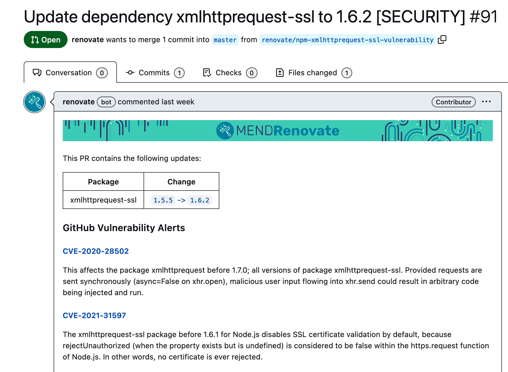

I learned about [Renovate](https://docs.renovatebot.com/) a couple of years ago when I was trying to group automated updates in Dependabot. It's 2023, and Dependabot is [still figuring out](https://github.com/dependabot/dependabot-core/issues/1190) how to implement grouping. Not blaming them; dependency updates are challenging. Regardless of the approach you take, a fair amount of work is required to set up tools and processes for dependency management. In this post, I have collected a few of my favourite features and tricks when working with Renovate. Have I missed anything? Of course! Renovate is highly configurable (and well-documented), so if you need the full guide, please consult the official docs.

## How Renovate works

Before delving into the details, let's ask ChatGPT for a quick summary of how Renovate works:

> Renovate is an open-source tool designed to automate the process of updating dependencies in a project. It works by identifying relevant package files within a codebase (including monorepos), then generating and scheduling pull requests to update those dependencies and their associated lock files. Users have the ability to customise the behaviour of the Renovate bot through configuration files and share configurations using ESLint-like presets.

The easiest way to get started with Renovate is to install it in your repo as a [GitHub App](https://github.com/apps/renovate):


Renovate will automatically open a ["Configure Renovate" PR](https://github.com/kalabro/kalabro.tech/pull/42) with meaningful defaults. Once the config file is merged, Renovate will start opening regular pull requests with dependency updates. In theory, that's it. In practice, you'll likely want to tweak the configuration and fine-tune it to suit your specific needs and preferences.

## Feature 1: config presets

Renovate supports hundreds of configuration options, or at least it feels that way. The resulting configuration file, even for a simple app, can end up being huge and cryptic. Fortunately, Renovate provides config presets that allow you to abstract away the details and share config pieces across multiple projects.

One crucial config preset to be aware of is [config:base](https://docs.renovatebot.com/presets-config/#configbase). It enables core Renovate features such as the Dependency Dashboard and monorepo grouping (more on this later in the article). It's a good idea to base your configuration on `config:base` or, in the case of JavaScript projects, on the `config:js-app` or `config:js-lib` presets.

Here is an example configuration for my personal blog powered by Gatsby:

```json
{
  $schema: "https://docs.renovatebot.com/renovate-schema.json", // up to date schema with all supported properties
  extends: [
    "config:js-app",       // base on the recommended config for JS applications
    "schedule:monthly",    // can be schedule:weekly, schedule:weekends, etc
    "npm:unpublishSafe",   // the release must be at least 3 days old
    ":approveMajorUpdates",// require explicit update approval on the dashboard before opening PR
    ":maintainLockFilesWeekly" // regenerates lock file to update all indirect deps
 
  ],
  transitiveRemediation: true // apply security updates for indirect (transitive) NPM dependencies 
}
```

As it's a JavaScript project, I used the `config:js-app` preset. I configured the update schedule, enabled the minimum release days restriction, disabled automatic PRs for major updates, and enabled weekly lock file maintenance. All using the default config presets. Thanks to JSON5 support, I can add comments to my config!

If I have multiple projects similar to this one, I can convert my new configuration into a preset and refer to it in the config of the other projects:

```json
{
  $schema: "https://docs.renovatebot.com/renovate-schema.json",
  extends: [
    "github>kalabro/kalabro.tech//renovate/js-app", // loads my base config from another repo
  ],
  // Further extending config for this specific project
  postUpdateOptions: ["yarnDedupeHighest"],
}
```

It assumes that my [shareable config](https://docs.renovatebot.com/config-presets/) is available at `https://github.com/kalabro/kalabro.tech/renovate/js-app.json`. As you probably guessed, you can keep customising the final config using other presets or configuration options. For example, you may need to group (or exclude) certain dependencies to reduce update noise.

## Feature 2: grouping related updates

My blog has 20 Gatsby-related dependencies (what a mess, but it's a topic for another blog post 😄). Updating them one by one is distracting and also likely to cause issues. What if we could ask Renovate to group all gatsby-* dependencies in one PR? No problem at all:

```json
{
  "packageRules": [
    {
      "matchPackagePatterns": ["^gatsby"],
      "groupName": "Gatsby packages"
    }
  ]
}
```

[packageRules](https://docs.renovatebot.com/configuration-options/#packagerules) is a cool and flexible config option for grouping Renovate updates. However, in my case, it's not even necessary! My default config already has built-in knowledge on how to group [Gatsby dependencies](https://docs.renovatebot.com/presets-monorepo/#monorepogatsby), thanks to Renovate's base preset. It encompasses a wide range of curated package rules, especially for the Javascript ecosystem. Whether it's Angular, Vue, or anything in between, Renovate has you covered.


A few typical use cases for the packageRules configuration:

- Separating dependencies and devDependencies. The latter is easier to automerge.
- Modifying the update schedule for specific types or groups of updates.
- Restricting updates for certain packages.

A word of caution. Although it may seem counterintuitive, I have found that smaller and more frequent updates tend to be more effective than large grouped PRs.

## Feature 3: lock file updates

Renovate performs update checks for your direct dependencies, which are the ones listed in the package.json file. These direct dependencies can themselves have their own dependencies, which are known as indirect or transitive dependencies. Typical web projects often have much more transitive dependencies than direct ones. The easiest way to keep these dependencies up to date is by regularly refreshing the lock file. When you combine this approach with [dependency pinning](https://docs.renovatebot.com/dependency-pinning/), lock file updates can be safely automerged.

```json5
{
  $schema: "https://docs.renovatebot.com/renovate-schema.json",
  extends: [
    "config:js-app",  // pins dependencies in package.json file
    ":maintainLockFilesWeekly", // regenerates lock file to update all transitive deps 
  ]
}
```

If you prefer ranges (`"^1.2.3"`) to pinning (`"1.2.3"`), lock file maintenance **will update everything** according to the ranges specified in your package.json. If this is what you are looking for, take a look at [`config:semverAllMonthly`](https://docs.renovatebot.com/presets-config/#configsemverallmonthly) preset for inspiration.

## Feature 4: Dependabot integration

Wait, what?  
Yes, Renovate delegates vulnerability checks to Dependabot. When running on GitHub, Renovate checks Dependabot security alerts and immediately triggers the corresponding updates. To utilise this feature, you need to enable Dependabot alerts in your project settings.

A vulnerability remediation PR may appear as follows:



Of course, this feature is configurable via the [vulnerabilityAlerts](https://docs.renovatebot.com/configuration-options/#vulnerabilityalerts) setting.  
You can also override the [`prBodyTemplate`](https://docs.renovatebot.com/configuration-options/#prbodytemplate) setting to remove the Renovate banner at the top.

## Feature 5: Dependency Dashboard

For quite a while, I thought Renovate was a typical CI tool without UI. Luckily, I was mistaken. Renovate comes with a Dependency Dashboard where you can find a summary of all opened and pending updates, as well as any configuration issues. Below is a screenshot of the [Dependency Dashboard](https://github.com/kalabro/kalabro.tech/issues/43) for this blog (don't worry about all the security issues, it's a static website):


Instead of jumping back and forth between different PRs and Renovate app logs, I can view and manage everything from one place. It's even more helpful when you're maintaining multiple repositories.

## To summarise

If you're seeking an automated dependency management tool, I can confidently recommend Renovate. It's well-designed, flexible, and open source. After using it for over a year, I particularly enjoy some of its features, such as shareable configs and the Dependency Dashboard. However, be aware that the initial learning curve can be steep, especially if you can't use the preconfigured GitHub app.

Are you using Renovate or any other dependency management tool? I'd love to know about your experience in the comments [on DEV](https://dev.to/kalabro/it-depends-exploring-my-favourite-renovate-features-for-dependency-updates-3j5a)!