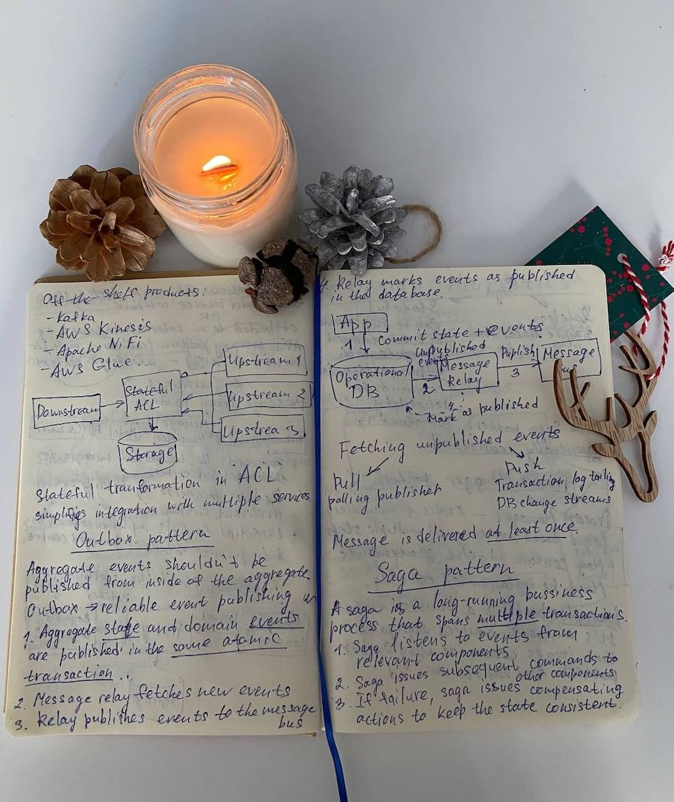

> "Selling is hard, and personally, I hate selling. That said, if you think about it, designing software is selling. We are selling our ideas to the team, to management, or to customers."   
> Vlad Knononov, ["Learning Domain-Driven Design"](https://a.co/d/ez4dQLr)

It’s 2023, and ChatGPT will probably write a summary of any book much better than I can. Finally, being personal and opinionated becomes an advantage!

## My story

When a while ago I was preparing an onboarding plan for a new team member, I realised how many project-specific concepts, terms, and acronyms I had in my head. I decided to start a glossary and asked the new team member to research the meanings of the listed terms and acronyms by reading documentation, talking to other team members, or asking the client directly. Without knowing it, I started creating a “ubiquitous language”, a key element of the Domain-Driven Design approach.

> **First takeaway:** do what makes sense. You’ll probably figure out later on that someone invented a methodology around that.

Many years later, I was lucky to catch Vlad Khononov at the GSAS conference in Barcelona and asked him how to become a better programmer. It’s a surprisingly difficult question, even for experienced developers. Take a moment to think of your own personal and opinionated answer.

> **Second takeaway:** ask people questions that you care about and be open to unexpected answers.

Vlad advised starting with “A Philosophy of Software Design”, my all-time favourite among software engineering books. As I had already read it, Vlad had to come up with another answer, and coincidentally, it was his own book “Learning Domain-Driven Design”.

> **Third takeaway:** read “A Philosophy of Software Design” by John Ousterhout if you haven’t yet

Back then, I had zero knowledge of DDD. I was aware of a few popular architecture patterns, and that’s it. As a Full Stack web developer, my day-to-day job was glueing existing services and frameworks together rather than drawing sophisticated UML diagrams. Yet I was intrigued by conspiracy around software architecture topics. Take a look at this famous definition for example:

> “Architecture is about the important stuff. Whatever that is.”  
> Ralph Johnson

When I read “Clean Architecture” by Uncle Bob several years ago, I didn’t quite understand the book’s core ideas behind all that SOLID jargon, primarily because I couldn’t map the proposed “clean” solutions to my day-to-day experiences. Three years later, I finally started building that understanding, thanks to the “Learning Domain-Driven Design” book.

> **Fourth takeaway:** keep exploring the topic that interests you until it clicks. It will eventually.

## How I understand Domain-Driven Design today

Quoting Vlad, “Domain-Driven Design is about letting your business _domain_ _drive_ your _design_ decisions.”

In the era of copy-paste-driven design, DDD suggests pausing and thinking deeply about the problem we attempt to solve with our favourite tools and patterns. It encourages us to build a shared understanding of that problem by speaking to business and, more importantly, by speaking the same (ubiquitous) language with them.

On a high level, DDD is about answering questions What? Why? How?

As people on all levels tend to jump straight to “How?” DDD offers some tools to help answer these questions in the correct order and, as a result, to build an appropriate software solution. Most DDD tools just make sense, similar to my glossary example at the beginning of this article.

## EDA, DIP, OHS, ACL, ETL, CQRS... What?

It gets interesting when DDD meets the reality of modern software development. 20 years ago, when Eric Evans first introduced DDD, I was writing my first CSS and HTML code. The amount of tech acronyms has only grown since. In “Learning Domain-Driven Design”, Vlad walks us through all the common patterns and principles in a way that makes sense.

For example, I finally understood what Hexagonal architecture is and when to use it. On top of that, I’ve got an excellent overview of analytical data platforms. My favourite part of the book is Chapter 14: Microservices. I won’t attempt to summarise it here. Instead, I encourage you to read the book yourself if you are interested in a practical intro to the most common software architecture patterns such as Microservices, Event Driven Architecture, CQRS and more.

As a Full Stack developer, I found this overview very handy. I may not need all described patterns immediately, but I need to know they exist.

 

I must warn a fellow reader that a quick flip-through will not be enough if you are relatively new to software architecture. I had to take notes and re-read certain parts of the book to understand certain concepts.  

> **Fifth takeaway:** prepare for thorough reading to get the maximum from this book.

## Design heuristics

After explaining the foundations for DDD, the book offers a good amount of advice on how to apply DDD in real life. In many cases, you can derive the appropriate implementation patterns after analysis of the business domain. If you picked the wrong implementation, no worries. The book suggests ways to migrate from one implementation pattern to another.

Another insightful heuristic is around testing strategies. There are three popular approaches: testing pyramid, testing diamond, and inverted testing pyramid. Vlad argues that there is no one right testing strategy and explains when to use which. I was able to prove it myself when I looked at my tests. I take testing seriously, but I rarely write unit tests in my project and instead focus on end-to-end and integration tests. It reflects the fact that in web, we often work with simpler architecture patterns (e.g. “Transaction script” and “Active record” from the [“Patterns of Enterprise Application Architecture” catalog](https://martinfowler.com/eaaCatalog/index.html)) because they are more appropriate for the task.

> **Sixth takeaway:** DDD tackles software complexity, but it also tackles software simplicity, that is, how to not over-engineer our solutions just because we are excited by specific design patterns or technologies.

If you are an individual contributor without enough power to install DDD on a company level, the book outlines some baby steps you can take to shift the whole company towards DDD.

> **Seventh takeaway:** you don’t need a software architect title to start using DDD in your daily work

The book wraps up nicely with a case study of applying DDD in real life. The author shares some of the mistakes he has made while learning DDD and how his understanding of DDD was evolving throughout the years.

## To summarise

“Learning Domain-Driven Design” explains the ideas behind DDD and maps them to popular design and implementation patterns. As a bonus, you get introduced to Microservices, Event-Driven Architecture, Data Mesh, and more.

Some chapters are harder to read without the appropriate backend development experience. I treated it as a challenge and did my best to understand the CQRS pattern without ever seeing it in action. It is an opportunity for future writers to translate DDD ideas into examples tailored to specific audiences, e.g. Javascript developers. Back to the quote from the beginning of this article, we need to sell all these good ideas to developers who are very busy with tons of other stuff to learn.

There is a lot of work to be done in order to make software design best practices easy to understand and apply in practice. Many of the problems we face today have actually been discussed and solved in the past, but this wisdom has been lost in the back corners of the internet. Vlad Khononov’s book "Learning Domain-Driven Design" brings this wisdom back to us and explains it in a way that makes sense.
