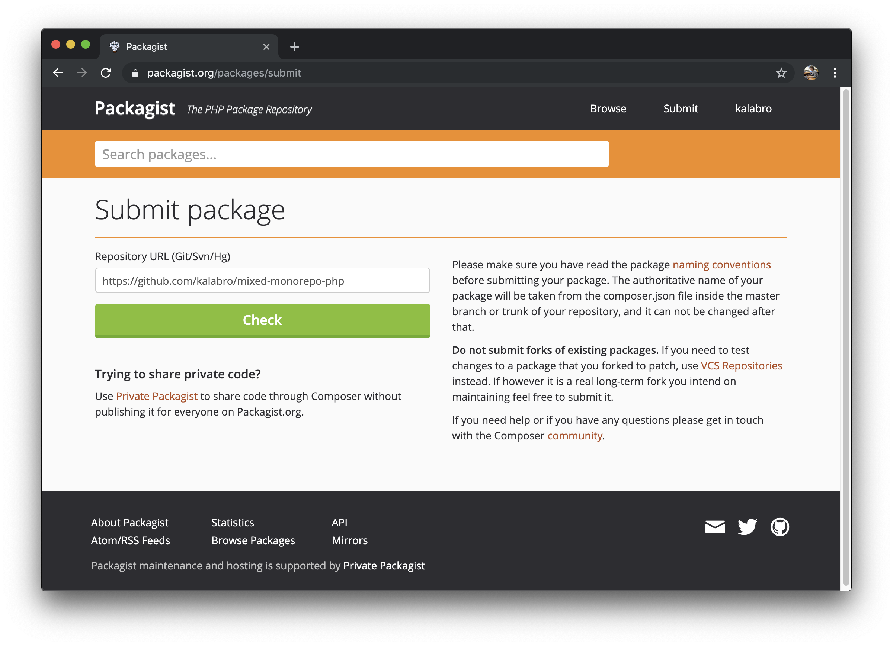

## On monorepos

Monorepo is a popular way of organizing code bases in large organizations like
Google, Facebook and Twitter. You can also find many open source projects that use a single git repository
to store and develop multiple sub-packages. Some examples are [Babel](https://github.com/babel/babel) and [Laravel](https://github.com/laravel/framework).

If you are not familiar with the term “monorepo”, check out [this 5 min video](https://www.youtube.com/watch?v=ZVsDA6GhKOU) from Fabien Potencier, creator of Symfony framework.

I personally have been using this technique for many years without knowing its name.
The idea is very simple: you store your `backend/` and `frontend/` folders in one
repository. This is a natural approach for full stack developers who usually
touch both folders on a daily basis. It is very handy to have entire project
codebase in one place when you develop and test the application. Below just a few benefits
that came to my mind:

- Fewer repositories to maintain on GitHub (less `git clone` and `git pull` commands to execute)
- Fewer steps to install full application on local machine
- Less CI configuration to spin up and test the entire project
- No mocking needed (all services are installed and available for testing without faking their APIs)
- Easier to deliver entire features that involve backend and frontend work

On the other hand, this approach isn't applicable to all teams and all organizations.
Read an article [“Don't ask if a monorepo is good for you – ask if you're good enough for a monorepo”](http://yosefk.com/blog/dont-ask-if-a-monorepo-is-good-for-you-ask-if-youre-good-enough-for-a-monorepo.html) to learn more about
monorepo disadvantages. It's important to remember [Conway's law](https://haacked.com/archive/2007/07/17/the-eponymous-laws-of-software-development.aspx/#conways-law):

> Organizations which design systems are constrained to produce designs which are copies of the communication structures of these organizations.

In case of SystemSeed, monorepos feel very natural because they reflect communication structures in a flat team of full stack developers.
For different kind of organizations, setting up a monorepo may require significant changes in development & collaboration practices, which is not always worth it.

## Automated releases

Back to original topic for this post, let's say we have a monorepo with two (or more)
separate packages written in different programming languages: PHP for backend and
Javascript for frontend. When changes are made in one of them, or in both, we want
the corresponding packages to be released in Packagist for PHP and in NPM for Javascript.

Initially I prepared myself for writing a lot of bash scripts in our CI to make automated
releases for both packages work. It turned out that everything has already been written in Javascript (Atwood's law in action), and all I needed is to install and configure a couple of packages.

### Step 1: install and configure semantic-release

From project description:

> semantic-release automates the whole package release workflow including: determining the next version number, generating the release notes and publishing the package.
>
> This removes the immediate connection between human emotions and version numbers, strictly following the Semantic Versioning specification.

If all your code is written in Javascript, you can skip further reading and go ahead with [semantic-release-monorepo](https://github.com/Updater/semantic-release-monorepo).

In my case, I had to install semantic-release for both packages separately.

**Example package.json for PHP:**

```
{
  "name": "@kalabro/mixed-monorepo-php",
  "version": "0.0.0-semantic-release",
  "description": "PHP subpackage from mixed-monorepo.",
  "author": "kalabro",
  "license": "MIT",
  "repository": "https://github.com/kalabro/mixed-monorepo-php",
  "release": {
    "plugins": [
      "@semantic-release/commit-analyzer",
      "@semantic-release/release-notes-generator",
      [
        "semantic-release-slack-bot",
        {
          "notifyOnSuccess": true,
          "notifyOnFail": true
        }
      ]
    ]
  },
  "scripts": {
    "semantic-release": "semantic-release"
  },
  "devDependencies": {
    "semantic-release": "^15.13.18",
    "semantic-release-slack-bot": "^1.1.2"
  }
}
```

**Example package.json for Javascript package:**

```
{
  "name": "@kalabro/mixed-monorepo-js",
  "version": "0.0.0-semantic-release",
  "description": "JS subpackage from mixed-monorepo.",
  "main": "index.js",
  "author": "kalabro",
  "license": "MIT",
  "repository": "https://github.com/kalabro/mixed-monorepo-js",
  "release": {
    "plugins": [
      "@semantic-release/commit-analyzer",
      "@semantic-release/release-notes-generator",
      "@semantic-release/npm",
      [
        "semantic-release-slack-bot",
        {
          "notifyOnSuccess": true,
          "notifyOnFail": true
        }
      ]
    ]
  },
  "publishConfig": {
    "access": "public"
  },
  "scripts": {
    "semantic-release": "semantic-release"
  },
  "devDependencies": {
    "semantic-release": "^15.13.18",
    "semantic-release-slack-bot": "^1.1.2"
  }
}
```

Note that Javascript version has "@semantic-release/npm" plugin enabled. This
is default semantic-release behavior that I switched off for PHP. When CI will call
semantic-release (later in this article), semantic-release will do the following:

- Analyze all commit messages since previous release.
- Decide which version number to assign to the new release based on [Angular Commit Message Conventions](https://github.com/angular/angular.js/blob/master/DEVELOPERS.md#-git-commit-guidelines).
- Add a new git tag for this version and push the tag to the remote origin (along with changelog notes).
- Release to NPM (optional, switched off for PHP).
- Notify the team in Slack.

### Step 2: Publishing to Packagist

To add a new package to Packagist you need to link a repository with a valid composer.json file
in the repo root.



It means that I have to push PHP code from my monorepo
to a separate PHP-only repo for Packagist to be happy.

To mirror monorepo to separate child repositories, I used [splitsh-lite](https://github.com/splitsh/lite), the tool that is used by Laravel and Symfony for the same purpose. The tool finds commits that affected the package's codebase and pushes them to another repository. Obviously, it preserves all commit information so that
semantic-release can decide what kind of release to create for each package.

### Step 3: Configuring CI

In SystemSeed, we've been using Circle CI long before I joined the team in 2015.
I've never worked with other CI tools but they all seem to be quite similar.

You can find example setup for Circle CI in a [demo project](https://github.com/kalabro/mixed-monorepo) on GitHub.

CI setup contains two steps. First, on merging in master `splitsh-lite` script is triggered.
It mirrors new commits (of any) to the corresponding child repos.

- See Circle CI config here: https://github.com/kalabro/mixed-monorepo/blob/master/.circleci/config.yml#L13
- See `./bin/split.sh` code here: https://github.com/kalabro/mixed-monorepo/blob/master/bin/split.sh (inspired by [the script in Laravel repo](https://github.com/laravel/framework/blob/6.x/bin/split.sh)).

The second step is to trigger semantic-release for each child repo. Again, a simple Circle CI config
handles it on every push into child repo: https://github.com/kalabro/mixed-monorepo/blob/master/js/.circleci/config.yml


### Result

You can find full monorepo setup for a real project here: https://github.com/systemseed/falcon

Falcon repo includes Drupal distribution on backend (*falcon/ folder*) and
complementary React frontend (*falconjs/ folder*). The latter uses [yarn workspaces](https://yarnpkg.com/lang/en/docs/workspaces/)
inside to organize multiple JS packages & templates.

All you need to start developing is to clone the repo and run **make install**.
When you are done and your pull request is merged in master, CI will figure out
what to release and which version numbers to assign.

Give it a try and let me know your thoughts!