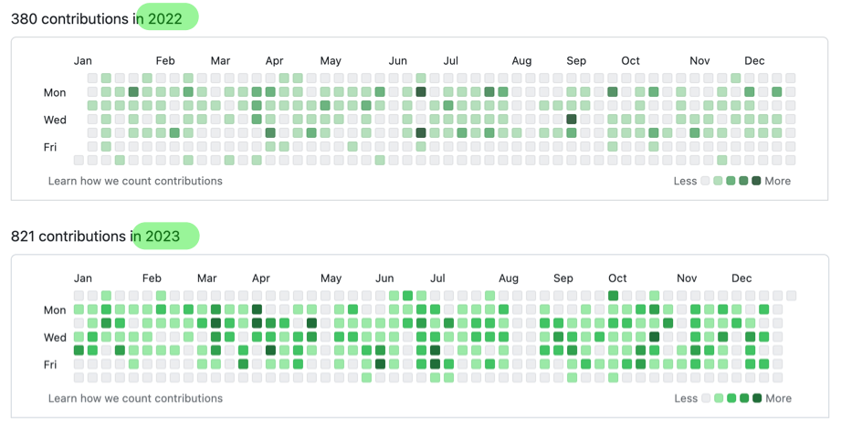

_This type of post is more useful for the author than the reader, so feel free to skip to the comments. Whether you are my reader, teammate, mentee or mentor - I’ll be super happy to receive a comment or a thumbs up from you._

_Happy holidays, and see you next year!_

Below are some highlights from my year in tech:

### Mentorship

This year, I’ve delivered 1000+ mentorship minutes on ADPList, plus a couple of paid sessions on [codementor](https://www.codementor.io/@kalabro) and [topmate](https://topmate.io/kalabro). At the same time, I was lucky to find a great long-term mentor for myself. Highly recommend a longer commitment over a one-off chat!

The most common topics discussed in my sessions were job hunting and breaking into tech. While we expect more layoffs and hiring freezes in 2024, I’m optimistic about long-term opportunities in our field. Mentorship is one of the tools to spark and maintain the positivity and self-confidence necessary for overcoming the challenges of 2024.

Finally, I recommend the [Coaching Habit book](https://www.goodreads.com/book/show/29342515-the-coaching-habit) to everyone who wants to better support and empower others.

### Coding

In 2023, I doubled the volume of my code contributions. Solving problems with code is something that brings me pure joy.

 

This year, I had a chance to work on frontend and backend, from microservices to microfrontends, with classic databases and asynchronous messaging mechanisms. I discovered my natural ability to navigate foreign codebases and pick up new tools quickly. I’m an okay coder, but with much more practice (and Copilot), I made great progress this year.

After reading that last line, you may think that I’m being humble. Yes and no. I somehow have never needed to be very good at programming, but at the same time, it’s part of my job that I admire most.

### Writing

It’s been a good year for this blog. Below are all the articles I published in 2023:

#### On soft skills:

- [Where to find a mentor](https://kalabro.tech/where-to-find-mentor-2023/)
- [Three tricks to get in focus mode](https://kalabro.tech/focus-mode-three-tricks/)
- [Budgeting my communication capacity](https://kalabro.tech/communication-budget/)
- [Onboarding yourself as a Senior Software Engineer](https://kalabro.tech/onboarding-yourself/)
- [Learning at work: common obstacles and how to overcome them](https://kalabro.tech/learning-at-work/)

#### On software design:

- [“Learning Domain-Driven Design” - the software architecture 🐒 book that makes sense](https://kalabro.tech/learning-domain-driven-design-book/)
- [The road to Software Architecture (frontend edition)](https://kalabro.tech/road-to-software-architecture-frontend-edition/)
- [Thinking Architecturally (book review)](https://kalabro.tech/thinking-architecturally/)

#### On tools:

- [Flutter guide for React developers](https://kalabro.tech/flutter-for-react-developers/)
- [Fast by default with Next.js](https://kalabro.tech/fast-by-default-nextjs/)
- [It depends! Exploring my favourite Renovate features for dependency updates](https://kalabro.tech/it-depends-renovate/)

#### On events:

- [React Alicante 2023](https://kalabro.tech/react-alicante-2023/)
- [Advent of Frontend Architecture - supporting materials](https://kalabro.tech/advent-of-frontend-architecture-2023/)

If you had a chance to read some of them, which was your favourite?

### New job

After joining New Work as a Senior Frontend Engineer (technical interviews are easier for specialists 🤷‍♀️) I immediately transformed myself back to Full Stack and received the highest rating in my recent performance review.

I approached my new job as a giant learning class and took every opportunity to test my skills. The list of tools I touched is enormous. My favourites are Turborepo, MSW, Nest.js, GraphQL Mesh, Datadog and ArgoCD.

My least favourites are all Microsoft products. Luckily, not all my communication happens in Microsoft Teams. I enjoy going to the office from time to time, having a long lunch with teammates, or giving a talk for a local meetup.

I also realised that my style and energy may have disturbed a few colleagues, and I hope they will forgive me. Working in a large company has helped me understand that every developer is different, with different strengths, motivations and life situations.

### Tools

In 2019, I had a [similar post](https://kalabro.tech/my-tech-year-in-review-2019/) listing my main tools at work. Surprisingly, they haven’t changed much:

- Macbook Pro M1 (14 “/16”)
- Firefox and Chrome (but I try to avoid Chrome)
- BetterTouchTool
- VS Code
- ChatCPT & Copilot (new)
- Docker
- iTerm ([my approach to the command line](https://kalabro.tech/no-geek-command-line/))
- PhpStorm (still using for some tasks)
- Evernote
- 1Password
- Remarkable (new)

### What’s next

2023 has been one of my best years in tech. I re-discovered the joy of web development, met many like-minded people and laid a foundation for the next steps.

Speaking in DDD terms, I aim to work more on the “core” subdomains, i.e. complex business problems. Opening a hundred pull requests is easy, making a real organisational impact is harder.

One way to make my work more impactful is to increase scope, e.g. zoom out to the architectural level. For that, I’ll continue exploring software design practices and common system design patterns.

On the other hand, I want to explore less safe ways to do things, e.g. bringing new ideas, experimenting, and questioning the status quo. For that, I wish myself, and all of us, a lot of courage, creativity and self-confidence in 2024.

Let’s have a fantastic new year! 🎄
