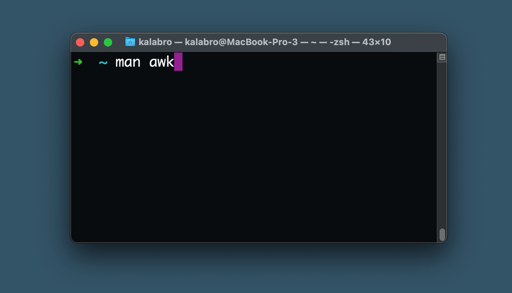

There is an idea that every developer should master tons of sophisticated tools and keyboard shortcuts to be truly professional and efficient. 

My experience doesn't confirm it. As an example, let me show you my command line setup. I'm not a sysadmin, but as a full stack developer with 10+ years of experience I use the terminal on a daily basis yet I've got a very basic setup:
- No tmux
- No aliases
- No special .dotfile configs
- No shell preference. I'm fine with zsh, bash, ksh, etc
- No jokes on how to quit vim 🔫

## My favourite terminal shortcuts:

- Ctrl+R to explore the history
- Ctrl+C to cancel / cleanup current command
- Ctrl+L to clean the screen
- Ctrl+A / Ctrl+E to jump to the beginning / end of the command string

## My top-used commands
- git
- j ([smart `cd`](https://github.com/wting/autojump))
- make
- ls
- rm
- cat
- grep
- vi
- yarn, npm, npx, composer, docker-compose and other project-specific CLI tools

You can grab your most used commands too: [How do I see what my most used linux command are?](https://superuser.com/questions/250227/how-do-i-see-what-my-most-used-linux-command-are)

## Why I stick to defaults
Apart from [autojump](https://github.com/wting/autojump), everything else in my setup is quite basic. I try to stick to defaults as much as possible. This is why:

**Common use cases are easy to google.**  
StackOverflow is full of advice on how to do X, Y, Z in the terminal. In 99% of the cases the solution will use standard tools that are already available on my machine: `ls`, `rm`, `cat`, `find`, `grep`, `awk`, `sort`, `sed`, `curl`, `chmod`, etc. 

**Non-standard tools require installation.**  
If I make [`rg`](https://github.com/BurntSushi/ripgrep) or [`ag`](https://github.com/ggreer/the_silver_searcher) my default search tool, I'll have to install it on the remote servers, in the CI environments, in the cloud IDEs, on my colleagues' machines. It's not always possible.

**Customisation requires more learning and memorising.**  
Now I need to learn how to use both the new tool (let's say `ag`) and the standard pre-installed tool (usually [`grep`](https://linuxjourney.com/lesson/grep-command)). Otherwise, I won't be able to work in remote environments, help a teammate (or receive help from them), debug a CI script, etc.

**Updates and troubleshooting.**  
Custom setup can become outdated, can introduce bugs or security issues. I can simply forget that I installed a tricky git helper a year ago and it will cost me a day of troubleshooting at some point.

## Learn the basics and have fun!
Most of the modern development stacks assume basic command line knowledge. The keyword is _basic_: you don't need to make Vim your default text editor or master tmux to become a better developer. If you normally spend 30% of your time in, let's say, Chrome DevTools and another 30% in VS Code, then you'd better master Chrome DevTools and VS Code first.

As a developer and Tech Lead, I think of the terminal mastering as something extra that I'm free to do if I _want_. After all, it can be a lot of fun! But I don't have to be a command line geek, and you don't have to either.

## Question for you

**What is your favourite CLI command or shortcut?**

Mine is `Ctrl+R` shortcut to search through my command line history. This is how it works:
1. Hit `Ctrl+R`
2. Start typing any part of the previous command you want to run again, e.g. `exec`
3. You command line will be prepopulated with the most recent command that contained `exec`
4. If it's not the right one, hit `Ctrl+R` again to cycle through older commands.

---
[Please join discussion on DEV to respond](https://dev.to/kalabro/my-approach-to-the-command-line-1kfm) 👩‍💻🧑‍💻
