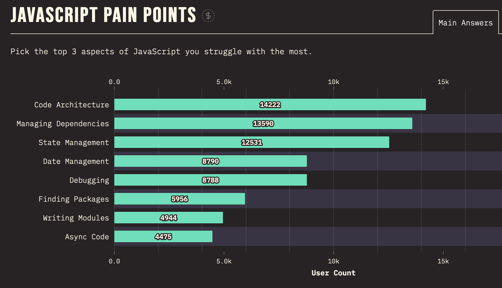

According to the [State of JS report](https://2022.stateofjs.com/en-US/opinions/#top_js_pain_points), the “Code Architecture” problem was the main pain point for JavaScript developers in 2022.

In this post, I argue that folders are better than microservices, disagree with Uncle Bob, and cite Martin Fowler’s advice against the Gang Of Four book. This is my road to Software Architecture. Let’s go!

## My background

As a Full-Stack Developer, I’ve been involved in the software design process since very early in my career.

Even before I realised it, I started making everyday architectural decisions such as:
- where to put my code
- what & how to test
- which framework to use
- how to spread the work between multiple developers, and so on

It turned out these little decisions matter in the long run. Some pieces of PHP code that I wrote eight years ago are still in use in production.

The oldest React app that is currently in use was started by my team at SystemSeed in 2017 from the Create React App template. We’ve managed to stay on un-ejected CRA all these years and recently upgraded the codebase to React 18.

Another long-living project was built with [Next.js 2](https://vercel.com/blog/next2). Today it runs on top of Next.js 13 and serves thousands of users around the globe.

Working on such projects brings a lot of problems that I can classify as “Code Architecture” from the State of JS report. Let me elaborate on what I understand by that.

## Software Architecture (as I understand it)

There are many clever definitions of software architecture. In this article, I lean towards the term “software architecture” to avoid any confusion between “software design” and “UI design”.

Philosophically speaking, **software architecture work is about finding optimal answers to questions that don’t have one correct answer**. I mean those questions with zero answers on StackOverflow (apart from the famous “It depends”).

Architectural problems often appear at the worst possible moment, disturbing our coding flow and making us feel annoyed and uncertain. That’s why software architecture can feel like a pain point, but in fact, it’s an essential part of our jobs, and Copilots can’t do it yet!

Traditionally, software architecture decisions have been part of more senior roles’ responsibilities. Some companies even have a dedicated Software Architect role. That person, though, wouldn’t be able to decide on every little detail. They likely came from the backend background to oversee the systems on a very high level. So in practice, **developers who actually implement frontend applications are the main contributors to the resulting code architecture**.

That’s suddenly a lot of pressure on us! Let’s see how we can reduce our anxiety around code architecture and become better at it.

## Learn your tools

“Clean Architecture”, the famous book by Uncle Bob, states that we should design framework-agnostic architectures:

> Good architectures are centered on use cases so that architects can safely describe the structures that support those use cases without committing to frameworks, tools, and environments.

Really? Well, I’m hired as a framework specialist; how can I put it aside?

The answer turned out to be simple. Before you can put the frameworks aside, you need to learn a few of them on a very good level. Once you become fluent in a couple of frameworks, you start to see patterns and trade-offs. At that point, recommendations from Uncle Bob will start to make sense.

For example, these days, I focus on improving my React skills. For me, learning advanced React patterns is a valuable time investment and a good step towards understanding modern frontend in general.

My decision to focus on one established technology means **saying no to many other tools and frameworks** highlighted in the State of JS report. It's uncomfortable to feel "left behind," but I am confident that it will pay off.

As Nathaniel Schutta says in ["Thinking Architecturally"](https://tanzu.vmware.com/content/ebooks/thinking-architecturally): 

> I thought I’d “missed the wave” of some technology or another. What I didn’t appreciate at the time is that new technologies are a lot like buses — one comes every 15 minutes or so.

Once I understand the tool **deeply**, I start making more informed architectural decisions.

## Embrace folders

Many of us jumped into microservices way too soon. There is a much safer (and cheaper) option — folders!

**Folders are logical boundaries** of our modules, features, components, etc. Well-organised file structure makes project architecture readable and extendable.

React community has a couple of suggestions to start with ([1](https://reactjs.org/docs/faq-structure.html), [2](https://github.com/alan2207/bulletproof-react)). The official site says:

> If you’re just starting a project, don’t spend more than five minutes on choosing a file structure.

It’s not because file structure is not important. It’s because it should change as your project evolves. Let’s say you had to touch files from ten different folders to ship a new feature. It’s a sign that you need to review your folder structure (and your logical boundaries).

## Testable code

Most people write tests because they want to be confident that the app works as expected after code changes. As a nice bonus, **testable code results in better code architecture**!

For a long time, I was only using end-to-end tests that treated the resulting app as a black box. It allowed me to write mediocre code with spaghetti from dependencies, inconsistencies and workarounds. Everything changed when I started to imagine how I would write other types of tests for my code:

- **Visual regression test** (e.g. component look & feel with dummy content)
- **Unit test** (e.g. how the utility function calculates the fee based on ordered products)
- **Integration test** (e.g. how the Basket component responds to user interactions such as hover and click)
- **End-to-end test** (finally, how the entire shopping flow works in the browser)

Even if I don’t write all these types of tests, thinking about them helps me structure my code better.

## What about design patterns?

Design patterns in software are similar to the chords in music. Someone discovered them many years ago, but people keep combining the chords in many different ways to compose new songs.

Just like learning chords by the book may be difficult at the beginning, classic design patterns books may not make any sense for a frontend developer.

A quote from Martin Fowler’s review of the famous Design Patterns book:

> Despite my praise, this is not an easy book to read. I don’t recommend it until you’re pretty comfortable with the basic principles of OO design. Even then it takes a fair investment of effort to really appreciate the book. Unlike most books, however, it amply pays that investment.

Luckily, we can **learn about modern JavaScript and React design patterns from a free book [Patterns.dev](https://www.patterns.dev/)**. It describes all common patterns in a frontend-friendly language with practical examples and animations.

<video src="https://res.cloudinary.com/ddxwdqwkr/video/upload/v1609056518/patterns.dev/jspat-41_nxsnbd.mp4" autoplay="" controls="" playsinline="" loop="" width="100%"><source src="https://res.cloudinary.com/ddxwdqwkr/video/upload/v1609056518/patterns.dev/jspat-41_nxsnbd.mp4"></video>

<em><a href="https://www.patterns.dev/posts/observer-pattern/">Observer Pattern</a> animation from patterns.dev (video)</em>

[The Community Patterns](https://www.patterns.dev/resources/) section lists some framework-specific resources to dig deeper.

## Business logic

The pieces of UI logic we write for the frontend may be trivial, but their large volume and constant changes become a challenge as the projects grow. The most coherent approach to business logic that I have found so far is Domain-Driven Design (DDD).

DDD places a strong emphasis on building a shared understanding of the problem domain and focuses team efforts on the most important parts (“Core” subdomain).

> Domain-Driven Design is about letting your business domain drive your design decisions.   
> Vlad Knononov, ["Learning Domain-Driven Design"](https://a.co/d/ez4dQLr)

In other words, development teams should understand and stay focused on the problem the business is trying to solve for its users.

If it sounds too abstract, I recommend the “Learning Domain-Driven Design” book ([read my review here](https://kalabro.tech/learning-domain-driven-design-book/)).
I’m currently exploring ways to apply DDD principles to frontend architecture problems. Stay tuned for more articles on the topic.

## To summarise

Some questions about software development don’t have one correct answer apart from “It depends”. We face them every day, and our answers contribute to the architecture of the projects we work on.

Developers who know their tools and cover their code with tests tend to make better architectural decisions. That’s why I suggest starting by mastering essential frontend tooling.

Once we feel comfortable with the tooling, we can zoom out and think in terms of design patterns and business problems. It’s a whole new world! I made several attempts to enter it, and I found the following resources most helpful so far:

- [Patterns.dev](https://www.patterns.dev/) - frontend-friendly book on design patterns
- [“A Philosophy of Software Design”](https://www.goodreads.com/en/book/show/39996759) - my favourite software engineering book
- [Learning Domain-Driven Design](https://www.amazon.com/dp/B09J2CMJZY?ref_=cm_sw_r_cp_ud_dp_WFMGPCPV66M1VA8P2CCS) - good introduction to DDD ([my review](https://kalabro.tech/learning-domain-driven-design-book/))

That’s how far I went on my road to Software Architecture.  
Follow me on [Twitter](https://twitter.com/kalabro), [Mastodon](https://hachyderm.io/@kalabro), or [LinkedIn](https://www.linkedin.com/in/kalabro/) to stay updated on my next adventures.
