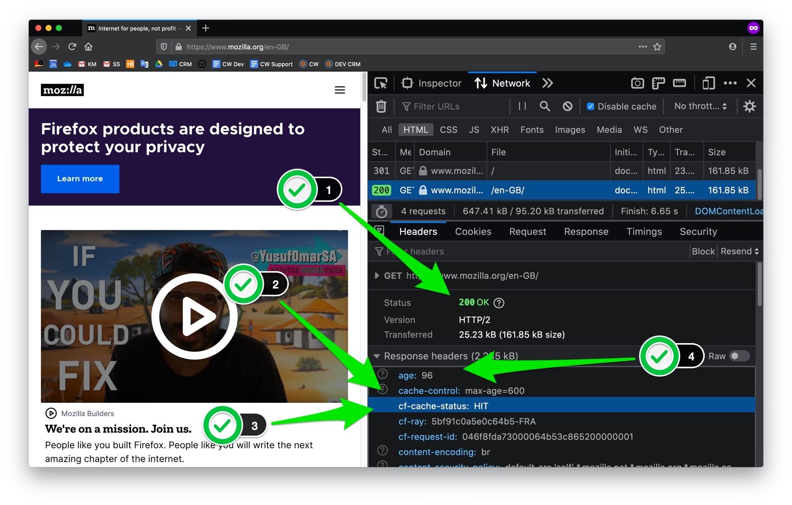
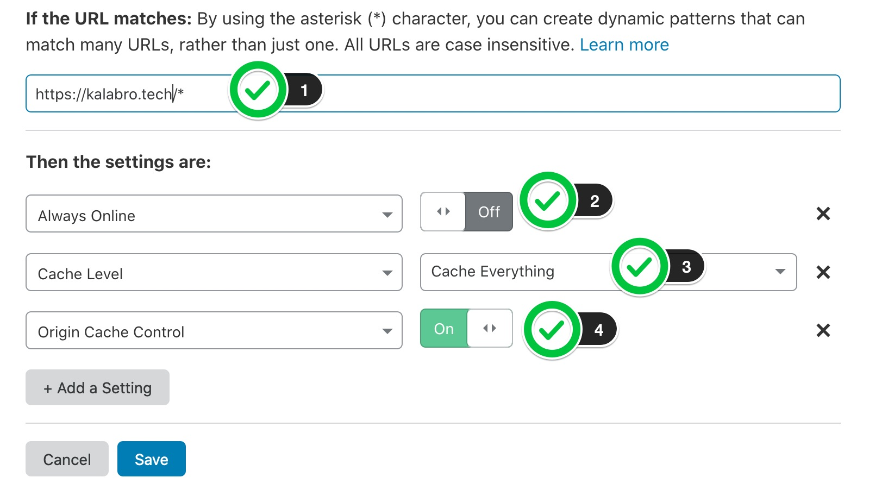
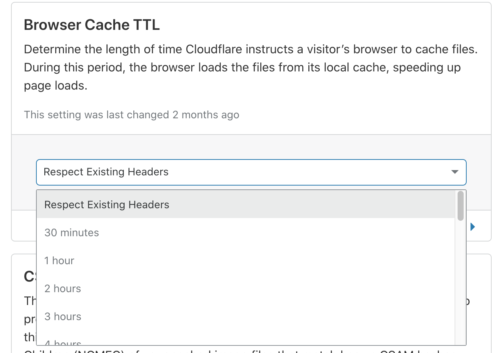
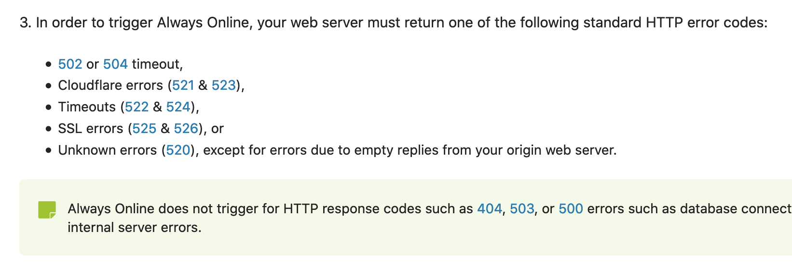

One obvious strength of static sites is their performance. The pages aren't
generated by the server but instead pre-built into HTML & CSS files.

Many of us developers have already played with the technology, built [their own
static site generator](https://www.staticgen.com/) and learned the pros & cons of this
approach. I won't discuss all of that in this article. Instead, I will remind
ourselves of something else that's been there for years — CDN.

These days CDN setup should not necessarily be very complicated and enterprisy. In fact, I will be using
free Cloudflare tier in my examples. Other CDNs have the same or similar setup.

## How it works

When your web server returns a page, let's say "https://www.mozilla.org/en-GB/", 
it also returns `Cache-Control` header explaining to the external world how to
cache this specific page. For example, it can say "do not cache me at all" or "cache me for an hour", please.

Browsers and CDNs respect `Cache-Control` header when they serve web pages. If the page can be cached,
they save it in their cache storage and next time serve cached version without ever touching your
web server. That's how a dynamic WordPress site can behave like static for the entirety of anonymous users.

Let's have a look at `https://www.mozilla.org/en-GB/`:



1. HTTP status of the page is 200 meaning that this page was not cached in user's browser yet.
2. Mozilla.org server returned `cache-control: max-age=600`, which means "Hey, browsers and CDNs: cache this page for 10 min max."
3. Cloudflare CDN indeed has already cached this page (HIT)
4. I've got a cached version which is 96 seconds old.

If within those 96 seconds something has changed on that page, e.g. a typo has
been fixed, then I will still see the outdated version for the next 504 seconds. 
To avoid the page with typo to be served from CDN cache, developers from Mozilla can either 
flush CDN cache from Cloudflare admin UI or by using their API.

Now let's dig into the details.

## Enabling cache beyond static files in Cloudflare

This step will vary for each CDN service. In Cloudflare, you need
to create so-called "Page Rule" that will enable "Cache Everything" mode for
specified page pattern. Example below: 



1. Apply this rule to the entire domain
2. (Optional) Switch off "Always Online" feature in favour of `stale-if-error` (will be discussed below)
3. Cache everything (as opposed to caching [only certain file extensions](https://support.cloudflare.com/hc/en-us/articles/200172516-Understanding-Cloudflare-s-CDN#h_a01982d4-d5b6-4744-bb9b-a71da62c160a))
4. (My favourite one) Respect "Cache-Control" header from my web server (also known as "Origin").

Note that I asked Cloudflare to follow `Cache-Control` directives returned by my web server.
It gives me unlimited flexibility in configuring caching TTL for different pages. 
In the following section, we will discuss it further. For now, I have to add that
in addition to item 4 you need to configure "Browser Cache TTL" setting in Cloudflare to 
"Respect Existing Headers". 



If you don't want to mess with `Cache-Control` in your codebase, you can ignore item 4 and "Browser Cache TTL" setting completely. Cloudflare will add `Cache-Control` header for you anyway and you will be able to fine-tune it by "Page Rules".

## Adding Cache-Control header to your dynamic content

In my experience different site pages and query params may have different cacheability opportunities.
Think of it as if parts of your site are completely static and others are very dynamic.
With `Cache-Control` you can achieve this behaviour. 

```
    server.get('*', (req, res) => {
      if (
        // Allow to bypass CDN cache by adding ?bypass=cdn to URL.
        req.query.bypass === 'cdn'
      ) {
        res.setHeader(
          'Cache-Control', 'no-store, must-revalidate'
        );
      } else {
        res.setHeader(
          'Cache-Control',
          'public, max-age=0, s-maxage=3600, stale-if-error=3600, stale-while-revalidate=30',
        );
      }
      return handler(req, res, app);
    });
```

The example above is a simplified Express handler to vary caching behaviour based on the incoming request.
You can achieve something similar in any popular web framework.

Note that `Cache-Control` directive is a bit more advanced in my example:

1. `max-age=0` - do NOT cache on a browser level
2. `s-maxage=3600` - cache on CDN (shared cache) for an hour
3. `stale-if-error=3600` - serve stale cached version for one hour more if the origin server is not available (supported by some CDNs)
4. `stale-while-revalidate=30` - serve stale version while the new version is being fetched from the origin server (supported by some CDNs)

You can build your version of `Cache-Control` that will serve your needs.

## Invalidating cache

In the case of a static site, you need to re-build and re-upload assets to your server.
Some services automate this process so that content editors don't have to deal with it.

We have a similar situation with CDN cache: if you want the newer version of the page
to become available to the rest of the world _right now_, then you need to invalidate the existing cache.
Cloudflare users can do it either in admin UI or via API.

If you use CMS e.g. [Wordpress](https://wordpress.org/plugins/cloudflare/) or [Drupal](https://www.drupal.org/project/cloudflare), they may have plugins for automated cache invalidation. 

Otherwise, you can call Cloudflare API directly in the appropriate place of your codebase.
The most used API endpoint is [`POST zones/:identifier/purge_cache`](https://api.cloudflare.com/#zone-purge-files-by-url) - purges cache for specific URLs. 

Note that Cloudflare doesn't offer cache purging by wildcard. There is "Cache Tags" feature on
Enterprise tier but I have never used it.

Other CDNs offer cache purging via API too. For example, Fastly has [soft purging](https://docs.fastly.com/en/guides/soft-purges) in addition to
hard purging. This is something I miss in Cloudflare API. Let's say I updated
content page in my CMS and it automatically purged cache for some URLs that were affected by my update. If I managed to break the site
with my update, then purged URLs will be down for all anonymous users.
With soft purge + `stale-if-error` you could stay always online.

Alternately to automated cache purging, you can just keep cache TTL very short (10 mins like in Mozilla example) instead of 
triggering automated cache invalidation on every content change. 

## stale-if-error or Always Online

As you may remember, I suggested to switch off Cloudflare's "Always Online"
feature (which is often enabled by default) in favour of `stale-if-error`.
`stale-if-error` isn't noticeable for the end users while
"Always Online" adds Cloudflare banner at the top of your web page informing your users
that the site isn't working at the moment. 

`stale-if-error` is a standard `Cache-Control` directive that is supported by other CDNs as well. 
It asks CDNs and browsers to serve stale cache if the page isn't available on the origin web server. Different CDNs can understand page availability differently. For example,
Cloudflare will respond with stale content only to the specific error codes:



500 or 503 error codes trigger neither Always Online nor `stale-if-error`.

## To summarize

Modern CDNs (and HTTP) provide a simple and elegant way to make parts of your site
behave like they are static. CDN cache protects the site from traffic spikes and makes some of
the site errors and instabilities invisible for end users. It's not just for heavy
enterprises. A mid-size website can save computing costs of their hosting by enabling CDN cache for the most
popular site pages.

Of course, you should still work on the performance of the original site but CDN cache can be 
nice low-hanging fruit in your journey 🍒

---
Liked this article? Have a question? [Please join discussion on DEV](https://dev.to/kalabro/let-cloudflare-cdn-speed-up-your-classic-website-like-it-s-static-oaf) 👩‍💻🧑‍💻