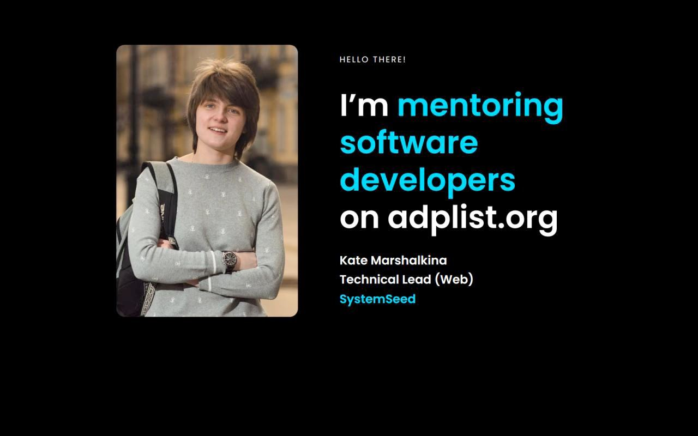

*Last year I had several mentorship/coaching experiences, and the results impressed me. In this article, I reflect on what worked for me and suggest how to get started.*

The most popular question I received last year was "Where to find a mentor". I used to respond with [this blog post from Gergely Orosz](https://blog.pragmaticengineer.com/developers-mentoring-other-developers/#places-to-find-mentors) with the list of engineering mentorship resources.

Soon enough, I realised that by asking "Where to find a mentor", people actually want to know if they need a mentor at all and how to get started.

First of all, if it came to your mind that you need a mentor, then you probably need one. I suggest starting with the following steps:

1. Choose one question
2. Answer your question yourself
3. Scan your existing contact list for potential mentors
4. Pick any available mentor from any mentorship service
5. Don't delay your first mentorship session

Let's go through the steps in detail.

## Choose one question

In a nutshell, mentorship is about asking and answering questions.

Preparing your questions in advance is good practice. However, I suggest going further and reducing the list of questions to just one.

Your first session will be about getting to know each other and understanding the context. Having more than one problem can feel overwhelming for both parties.

Of course, once you've established a good relationship with your mentor, you can "break the rules" if they are limiting. I personally stick to one question rule and finish the session earlier if I'm clear on the next steps.

## Answer your question yourself

After choosing a question, I try to answer it myself. This self-coaching practice helps me validate my question.

Let me give you an example. Imagine a person going to a pharmacy and saying, "I don't feel well, give me some pills". The pharmacist can't feel your body for you, so they will ask lots of questions until they can help. If the person does a bit of introspection to identify what exactly hurts, they will come up with a much clearer request.

Same with mentorship. The only person who knows all the context of your problem is you. Explore this context on your own so it's fresh when the mentor asks questions like "What have you already tried?" or "What piece of information do you miss to make a decision?"

Don't worry if you can't answer your question yet. It's important that you try.

The opposite can happen, too. You can find an obvious solution to your problem. In this case, you may want a mentor's help to verify your solution and go through the next steps together.

## Scan your existing contact list for potential mentors

The most expensive (and rewarding) part of mentorship is building a trusting relationship. You may already have a few great mentors in your immediate network.

You don't have to call it "mentorship" with them. This word can be interpreted as a serious commitment. Casual "I need your advice" works well for me.

## Pick any available mentor from any mentorship service

Scan the services from [Gergely Orosz's list](https://blog.pragmaticengineer.com/developers-mentoring-other-developers/#places-to-find-mentors) for mentors who are 3-5 years ahead of you career-wise. Book a session with someone who caught your attention and who has available time slots in the near future.

One can argue that we should carefully review the mentor's experience, reviews, ratings, social media, etc. In reality, people either match or don't match, and you can't predict it before meeting for your first session.

I wouldn't worry too much about wasting time with the "wrong" mentor. I've asked the same question to several different mentors and always learned something new.

## Don't delay your first mentorship session

Requesting your first mentorship session takes courage! Unfortunately, it took me a while to find that courage. I was using various excuses to delay taking action.

 
**Excuse 1: "I can take course A/read book B. New knowledge will resolve my questions."**

Books, tutorials, and courses offer general knowledge, while the mentorship experience gives us deeper, personalized understanding. Mentorship works because you, as a mentee, get all the attention and support from the other person you respect and trust. In some situations it's exactly what we need to take the next step.

**Excuse 2: "My problems are not new/not interesting. I will waste someone's time."**

As an aspiring mentor, I can confirm that mentors don't look for new problems; they have enough of them at their jobs. As a mentor, I am excited to help someone find their way through a problem. If it's something I faced myself in the past, then it is easier for me to guide the other person through it.

**Excuse 3: "I don't want to spend money on something that doesn't guarantee result"**

I have heard about expensive coaches who sell and upsell every second they talk to you. I overcame this fear by choosing from free options. I also figured out that most experts are very approachable when you DM them with your sincere ask for advice. Because there is no financial commitment, they are much more relaxed and honest.
In the case of paid options, I will first book a short intro session to see if I'm comfortable with my choice.

**Excuse 4: "They don't know my situation and won't be able to help"**

It turns out that a mentor needs to know "just enough" to help me find the solution. As we discussed earlier, the answer may already be there, and all I need is trust and support. Kind words don't cost us anything, but unfortunately, there is a huge lack of unconditional support in the world.

**Excuse 5: "Mentorship is only for junior developers"**

I think it's time to clarify the terms:

- **Teaching** - explaining in a very detailed way how to do things.
- **Mentorship** - answering questions that require expertise/experience.
- **Coaching** - asking questions that help the other person to solve their problems themselves.

The word "mentorship" is often used as an umbrella term for all three activities. Good mentors know when to give a very specific piece of information (teaching), when to share an example from their experience (classic mentorship), and when to ask an open question that welcomes a mentee to explore their problem deeper (coaching).

When I look at these definitions, I realise junior developers need more teaching: clear guidance and concrete steps. As they gain more experience, they require less teaching and more coaching, especially if they want to advance past certain career ladder levels.

## Next steps

This article focuses on a formal mentorship that is supposed to last for a certain period to bring visible results.

After talking to several experienced mentors, I learned they had seen most of their mentees only once. It is totally fine to have occasional one-off sessions when needed. On the other hand, it takes time to build a trusting relationship and to explore challenging topics deeply. If you have a long-term professional goal, I welcome you to consider regular mentorship sessions.

Another important aspect not to forget is communication with your peers. From "The Mentorship Diamond" article:

> You should have more contact with your peers than with mentors or mentees

At some point, you will become a mentor yourself. Being a mentor helps us grow in so many ways. I recently started as a mentor on <a href="https://adplist.org/mentors/kate-marshalkina">the ADPList platform</a>, and I will write about my experience soon. Stay tuned!

